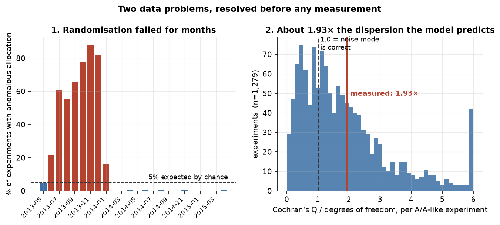
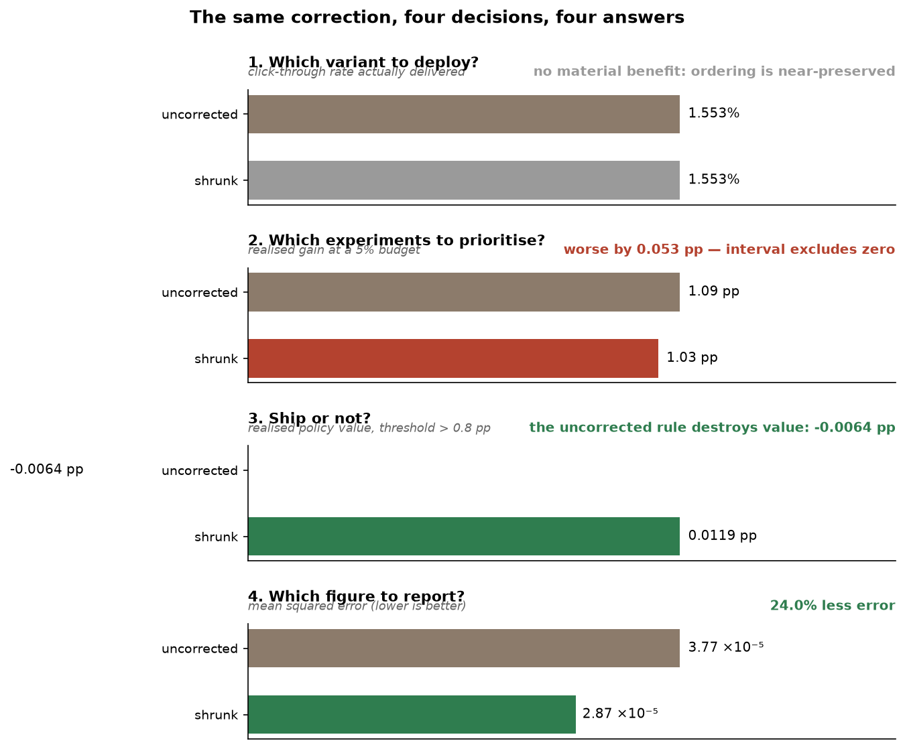
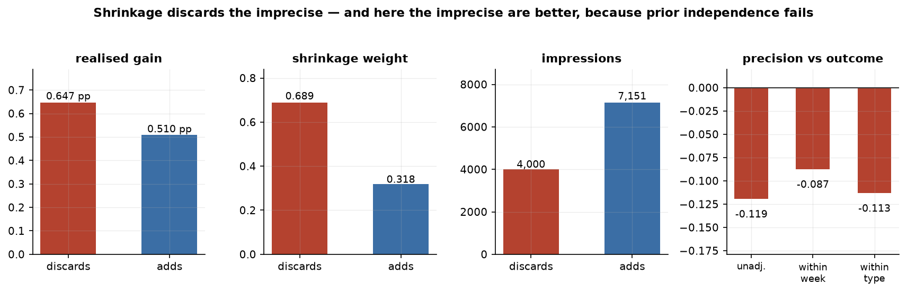
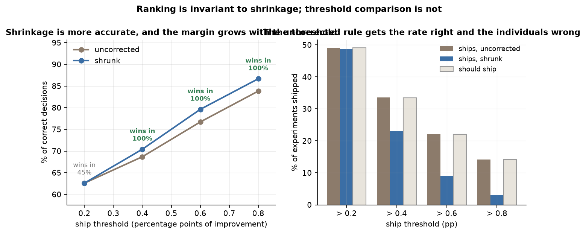

# Project Background

[](https://github.com/aalopez76/ab-testing-shrinkage-decisions/actions/workflows/ci.yml)

Organisations that decide through experimentation — digital commerce, media, marketplaces, healthcare, research — propose several versions of the same offering (advertisements, discounts, headlines, doses), measure which performs best, and deploy the winner. **However, the version selected for having performed best subsequently tends to deliver less than was expected.**

This is a well-documented problem known as **the winner's curse**. It arises because the selected offering owes its advantage to two things at once: partly to being genuinely the best performer, and partly to a component of luck — noise — that does not repeat on deployment. Its magnitude depends on the power of the experiment: at 80% power, a common design target, Gelman and Carlin's normal-design example gives an expected exaggeration factor of 1.12, about 12%. They show it rising sharply once power falls much below 0.5.

The correction the industry proposes is **empirical Bayes shrinkage**: pulling the winner's result towards the group mean, in a proportion that grows with the imprecision of the measurement. Microsoft reported applying an empirical-Bayes A/B framework at Bing, fitting the prior from thousands of past experiments; Meta presented *Bayesian Hybrid Shrinkage* at CODE@MIT in 2025; and **Spotify published its reasons for not adopting Bayesian A/B testing**, warning that a poorly calibrated prior is actively worse than not correcting at all. Adopting it changes how every result is reported to the business.

**The question this project answers is whether it is worth adopting, and for what exactly.**

Three published lines of work converge on evaluating experiments by the decision they produce rather than by estimation error alone. Among the closest antecedents reviewed, I did not find a public evaluation comparing standard empirical-Bayes shrinkage by realised out-of-sample value under this decision criterion.

Findings and recommendations are organised around four decisions:

- **Which variant to deploy** — ranking candidates within a single experiment.
- **Which experiments to prioritise** — ranking under a limited budget.
- **Whether to ship at all** — comparing against an absolute threshold.
- **What figure to report to the business** — the estimate itself.

Code is in [`src/wcab/`](src/wcab/), the scripts that produce every figure cited here in [`scripts/`](scripts/), the raw results in [`reports/results/`](reports/results/), and the charts in [`reports/figures/`](reports/figures/). Exact references for every method decision are in [`papers.md`](papers.md).

## Running it

```bash
python -m venv .venv
# activate the environment, then:
python -m pip install -e ".[dev]"

python scripts/00_download.py                      # fetches the archive from OSF
python scripts/01_panel.py --sample exploratory    # builds the canonical panel

ruff check .
pytest
python scripts/verify_reported_results.py
```

The archive is not redistributed here, so `00_download.py` is the first step and the
tests that assert properties of the data skip until it has run. The published bootstrap
results use `--replicates 2000 --seeds 3`; development runs use `--replicates 300`.
`requirements-lock.txt` records the clean environment used to reproduce the project; two
non-computational version differences from the original figure-producing environment are
documented in its header.

*Processing is Python over flat files, so there are no SQL queries, entity-relationship diagram or interactive dashboard to show. Development was carried out with AI assistance (Claude Code); every figure cited was produced by the scripts in this repository, and every published claim was verified against its primary source.*

---

# Data Structure and Initial Checks

**Upworthy Research Archive** ([Matias et al., *Scientific Data* 8:195, 2021](https://www.nature.com/articles/s41597-021-00934-7)): real A/B tests of headlines and images from a US digital publisher. **What these data reproduce is not any particular company's figures but the procedure itself** — launch several versions, allocate users at random, measure a conversion rate and deploy the winner — which is the same loop run by a retailer testing incentives or a laboratory testing doses.

The archive is of interest because it satisfies three conditions: **genuine randomisation**, which prevents the selection effect from being confounded with assignment bias; **many variants per experiment**, since the curse lives in the maximum over candidates and with only two there is little to select from; and an **exploratory/confirmatory split included by the authors**, which allows the method to be frozen and confirmed without contamination.

| | Exploratory | Confirmatory |
|---|---|---|
| Experiments after exclusion | 3,380 | **15,787** |
| Variants | 16,629 | **77,446** |
| Impressions | 58.8 million | **273.5 million** |
| Clicks | 749,878 | **3,492,259** |
| Variants per experiment | 2 to 14 (median 5) | 2 to 20 (median 5) |
| Click-through rate | 1.28% | 1.28% |

## Check 1: randomisation

A window covering **6,956 of 22,743 experiments (30.6%)** is excluded. A caching misconfiguration caused a single variant to be shown for months, and the archive's 2024 author correction identifies **25 June 2013 to 10 January 2014** as the likely affected period, about 7,004 tests or 22%.

**This project uses a wider, month-bounded window: 1 June 2013 to 31 January 2014.** It was frozen before the confirmatory sample was opened and is kept rather than narrowed to the official dates afterwards. The correction also added a `problem` flag to the updated main archive; **the legacy exploratory and confirmatory split files this project reads predate that flag**, so the window here was established from scratch using a goodness-of-fit test on impressions per variant, which reproduces the failure month by month: 22.3% in June 2013, **86.4% in December**, 11.0% in January 2014, and between 0.0% and 0.9% thereafter.

The retained period runs at the anomaly rate that would be expected by chance.

## Check 2: noise model (about 1.93× excess dispersion)

All shrinkage depends on the variance of each measurement, and experiments where no recorded treatment field varies between variants provide an independent benchmark. These are **inferred A/A-like experiments, identified from the treatment fields the archive publishes** — not deliberately designed A/A tests in which the true effect is known to be zero, a distinction that matters because the archive may not record every field that varied. Under the assumption that nothing else varied, observed dispersion should match the calculated one. It does not. Cochran's *Q* is **1.940** times its degrees of freedom in the exploratory sample and **1.927** in the confirmatory sample, and **replicates across both**.

What that figure establishes is **excess dispersion relative to the binomial benchmark in those experiments** — not a cleanly identified design effect, since the clustering and the unpublished-field explanations are not separable here.



## How out-of-sample evaluation is performed

Measuring how far the winner was inflated requires measuring it where it played no part in being chosen. Each variant's counts are split **hypergeometrically**, which for the family to which the binomial belongs yields marginally independent parts summing to the original observation. That result is **exact under the binomial observation model**.

It does not follow that the halves behave as independent real-world deployments. Check 2 found overdispersion relative to that very model, so if the excess comes from repeated visitors, sessions or unobserved heterogeneity, splitting aggregate counts does not reproduce the independence a fresh population would have. The partitions are therefore best read as **model-based held-out partitions**, and every out-of-sample guarantee below inherits that condition.

The split is into **three thirds** rather than two: one selects the variant, another estimates its advantage, the third evaluates. With two halves the between-experiment dispersion is estimated as zero, because the winner's advantage is an already-selected statistic and the method assumes an estimate that is not.

Uncertainty is reported as a **95% cluster-bootstrap percentile interval**, resampling whole experiments with replacement. An earlier version divided the spread across thinning seeds by the square root of their count, which measures how much the answer moves when the split moves — a quantity that shrinks towards zero as seeds are added — rather than uncertainty about the effect. Monte Carlo variability from the split is now reported separately from sampling uncertainty.

---

# Executive Summary

**The winner's curse is real and substantial:** the deployed variant promises 1.792% and delivers 1.553%, a **15.4% relative overstatement**. It is a selection effect rather than a measurement effect: choosing a variant at random yields an inflation a hundred times smaller.

**That magnitude is specific to how much data selects the winner, and the dependence was measured.** Reducing the selection share from 50% to 30% raises the estimated inflation by 41%; allocating 70% to selection lowers it by 21%. This is the known power dependence of the curse showing up as theory says it should, so the figure is read as *the curse under a half-split on this archive*, never as a constant of the phenomenon. **The sign and the substance hold at every split tested.**

**The correction does not fix what most people assume it fixes.** But the four decisions were not all specified at the same time, and that distinction is kept visible below rather than smoothed over.

## Stage 1 — pre-specified confirmatory analysis

The method was frozen as the code at commit `69dfd977`, and the confirmatory sample was then **first opened in a single pre-specified run**. It replicated to the third decimal place on a sample 4.7 times larger that was never touched during development.

**What that pre-specification rests on, stated precisely.** Git timestamps the analysis code at the freeze commit nine minutes before the commit carrying the confirmatory results, so the method was fixed before the confirmatory sample was opened. The written success criterion — **realised gain from the decision**, not reduction in estimation error — is recorded in [`reports/results/FROZEN_METHOD.json`](reports/results/FROZEN_METHOD.json), which names that commit but was itself committed two days later, during translation. **It is therefore a repository artefact rather than an independently timestamped pre-registration**, and it is reproduced in the language it was written in rather than rewritten after the fact.

**Primary decision analyses**

| Decision | Does shrinkage help? | Figure |
|---|---|---|
| **1. Which variant to deploy** | **No material benefit under balanced precision** | 99.8% of decisions identical |
| **2. Which experiments to prioritise** | **No, and it costs** | −0.069 pp **at the pre-specified 5% budget**, 95% cluster-bootstrap percentile [−0.092, −0.027] |

**Pre-confirmatory secondary estimation analysis.** The improvement in estimation error was measured before the confirmatory sample was opened, but it is not the frozen criterion: **−24.0% mean squared error**, replicated across both samples.

## Stage 2 — post-confirmatory exploratory analyses

These were devised **after the confirmatory sample had already been unblinded** and evaluated on it. Nothing about them is wrong, but they are not confirmations: they **generate hypotheses requiring independent confirmation**.

| Analysis | Finding |
|---|---|
| **3. Whether to ship** | At a 0.8 pp bar the uncorrected policy delivers **negative** value, −0.0064 pp, while shrinkage delivers +0.0119 pp |
| **BHS** (Meta, 2025) | Better fit and lower held-out estimation error, −28.1% |
| **Regime comparison** | Under their arm-quality filter no clear difference is detected, which is not an equivalence result and does not reproduce their two-arm construction |
| **Split sensitivity** | Winner inflation stays positive, and the estimation-error and prioritisation conclusions keep their direction, across every allocation tested |



What an experimentation lead should take away: **the correction clearly reduces overstatement in what gets reported, and it does not materially improve within-experiment ranking.** For threshold-based deployment decisions it shows promising value in this archive, which is a Stage 2 result rather than a settled one. The distinction between the three is not a nuance — it is a quarter of engineering effort well or poorly invested.

---

# Insights Deep Dive

## 1. Which variant to deploy: nearly invariant under balanced traffic, and the reason is algebraic

* **When the shrinkage weights are equal across an experiment's arms, shrinkage cannot change their ordering.** It is then a weighted average between the observation and a common centre, which is a monotonically increasing function of the estimator and **preserves the ordering**. Here the weights are nearly equal rather than exactly equal, and 99.8% of decisions are accordingly unchanged.

* **And in these data the weight is effectively identical:** it varies by 0.009 across variants of the same experiment, because they receive balanced traffic by design — the ratio between the most and least exposed variant has a median of 1.040. 99.8% of decisions turn out identical.

* **This is the degenerate case the literature already describes.** Under homogeneous variance, the posterior mean, the tail probability and the tail expectation produce the same ordering. With balanced variants there was effectively no within-experiment ranking problem for shrinkage to improve. The winner's curse itself does not disappear: it is still there in what gets reported, which is where the correction pays.

* **Practical consequence:** a team whose variants receive balanced traffic can rule out shrinkage as a meaningful way to improve within-experiment variant selection by measuring a ratio of impressions. That says nothing about the other three decisions, where it still pays.

## 2. Which experiments to prioritise: it degrades, and the pattern is consistent with precision−effect dependence

* **It genuinely reorders.** At a 10% budget the correction changes **23.0%** of the selected experiments.

* **And it selects worse.** At the pre-specified 5% budget, realised gain is **0.069 pp lower, 95% cluster-bootstrap percentile interval [−0.092, −0.027]**, which does not cross zero. The direction is stable across the three thinning seeds. The two figures come from different budgets and are stated separately for that reason.

* **The reordering mechanism is visible:** it discards experiments with a shrinkage weight of 0.689 and 4,000 impressions, and adds others with a weight of 0.318 and 7,151. That is, **it discards the imprecise and adds the precise**, which is exactly what theory says it does under a capacity constraint.

* **But those it discards had greater realised gain** (0.647 against 0.510 pp), which is the pattern prior independence forbids. The association between impressions and outcome is −0.119 unadjusted, **−0.087 within each week** and **−0.113 within each experiment type** — computed within week and, separately, within type, not jointly, and between total impressions and the aggregate rate rather than against the parameter being shrunk.

* **Practical consequence:** a negative precision−outcome association is a warning signal worth evaluating out of sample before using shrinkage to prioritise. On one archive it cannot establish that the sign predicts the outcome elsewhere.



## 3. Whether to ship: here shrinkage does win, and the uncorrected rule can destroy value

*Stage 2 — devised after the confirmatory sample had been unblinded. It requires independent confirmation.*

* **This project treats threshold deployment as a decision separate from ranking, consistent with recent decision-oriented experimentation work.** A common, strictly increasing transformation preserves ranking, so in the nearly homogeneous within-experiment setting here shrinkage is almost ranking-invariant. **Comparison against an absolute threshold is not invariant at all**: shrinkage changes the value, and therefore changes whether it crosses the line.

* **What is measured is the value the policy delivers, not how often it agrees with a second measurement.** For a threshold *u*, the policy ships arm *i* when its estimate clears the bar, and the value realised is what the independent evaluation partition says it delivered against that bar:

  *V*(π) = (1/N) Σ *a*ᵢ (δ_eval,ᵢ − *u*),  *a*ᵢ = 1(δ̂_est,ᵢ > *u*)

  Accuracy against `realised > u` was the earlier measure and is biased: the indicator of a noisy variable does not estimate the indicator of the truth without bias. It is retained in the results files as a secondary quantity and labelled as such.

| Threshold | Value, uncorrected | Value, shrunk | Difference | 95% cluster-bootstrap percentile |
|---|---|---|---|---|
| > 0.2 pp | +0.1143 pp | +0.1142 pp | −0.0000 pp | [−0.0005, +0.0003] |
| > 0.4 pp | +0.0424 pp | +0.0479 pp | **+0.0055 pp** | [+0.0043, +0.0083] |
| > 0.6 pp | +0.0083 pp | +0.0231 pp | **+0.0147 pp** | [+0.0127, +0.0176] |
| > 0.8 pp | **−0.0064 pp** | +0.0119 pp | **+0.0183 pp** | [+0.0148, +0.0202] |

Every interval above comes from 2,000 cluster-bootstrap replicates over three thinning seeds. **The approximation is settled at that size:** against 1,000 replicates the point estimates are identical to five decimal places, as they must be since they do not depend on the replicate count, and no interval endpoint moves by more than 2.0% of its own width. The same check on the prioritisation estimate moves its endpoints by 0.0014 pp against an interval 0.064 pp wide.

* **At the most demanding bar the uncorrected rule delivers negative value.** It is not merely less accurate: the arms it ships do not clear the threshold often enough to pay for those that do, so applying it is worse than shipping nothing. The corrected rule stays positive at every threshold.

* **The mechanism is in the rates.** At a 0.8 pp bar the uncorrected rule ships **14.2%** of experiments against **3.1%** under shrinkage. The held-out partition also exceeds the threshold in 14.2% of experiments, but **that quantity is itself a noisy indicator and is not the true prevalence of effects above the bar** — it is the same biased comparison that the move to policy value was made to avoid. The two rates coinciding is descriptive, not evidence that the uncorrected rule recovers the real prevalence.

* **At a lenient threshold the two are indistinguishable**, and the interval says so. The gain is not a property of the method alone but of the method and the bar together.

* **This is a common deployment decision**, and it is where the correction pays in this archive.



## 4. The reported figure: improves, and Meta's local-shrinkage variant improves further

* **The standard correction reduces estimation error by 24.0%**, replicated across both samples. This is what prevents promising the business improvements that never arrive.

* **BHS was also implemented**, the variant Meta published in 2025 with experiment-specific local shrinkage factors. This is a **Stage 2 exploratory extension**: better fit and lower held-out estimation error in this dataset, with the fitted parameter **a = 2.65** and a likelihood ratio of 961 against the standard version. **Numerical sensitivity and formal calibration of that likelihood-ratio comparison were not evaluated and remain outside scope**, so the ratio is reported as a fit statistic rather than as a test.

* **BHS estimates better: −28.1% held-out error.** But it does not change the ordering: the difference on decision 2 is +0.009 pp.

* **The reason had already been measured.** BHS corrects the **shape** of the prior through heavy tails; what fails in these data is **prior independence**. Making the prior more flexible does not make precision independent of the parameter: these are two distinct assumptions, and BHS addresses only one.


---

# Recommendations

For an experimentation team evaluating whether to adopt the correction:

* **The winning variant overstates by 15.4% in relative terms, and this is correctable.** **Adopt the correction for what is reported to the business**, where it reduces estimation error by 24% and replicates across both samples. **For threshold-based ship decisions, treat the result as promising rather than settled**: at a demanding bar it turns a policy of negative realised value into a positive one, but that is a Stage 2 exploratory finding and warrants independent validation before adoption.

* **The variants of an A/B test typically receive balanced traffic by design.** **Do not therefore justify the correction as an improvement to which variant is chosen**: measure the ratio of impressions between the most and least exposed variant, and if it is close to 1 there is an algebraic reason why it will not reorder.

* **The central assumption of the correction is that the true value does not depend on the precision with which it was measured.** **Before using it to prioritise across experiments, diagnose whether precision proxies are associated with realised outcomes. A negative association is a warning signal to evaluate out of sample, not a deterministic predictor of failure.** Here it is −0.12 unadjusted and remains negative within week and, separately, within experiment type.

* **Variance is the input on which the entire method depends, and here the observed dispersion is about 1.93× the binomial benchmark.** **Audit it against A/A or A/A-like experiments before anything else, and if the platform does not run them, start there**, because without an independent benchmark there is no way to establish whether it is correctly measured.

* **A winner's advantage is an already-selected statistic, and the method assumes an estimate that is not.** **When evaluating shrinkage on already-selected winners from the same observed counts, separate selection, estimation and evaluation**; this project uses a three-way thinning split for that purpose, because with only two parts the between-experiment dispersion collapsed to zero and the correction ceased to function. **This is an evaluation design, not an operational requirement**: applying shrinkage in production normally means estimating the prior from a corpus of past experiments, as Microsoft reported doing at Bing, and no three-way split of the current experiment is involved.

---

# Assumptions and Caveats

* **The noise model does not describe these data, and the two candidate explanations are not distinguishable.** Cochran's *Q* is approximately 1.93 times its degrees of freedom across both samples. This may be because impressions are not independent, or because fields the archive does not publish were varying. Both are declared, and the measured factor is applied to the variance of each variant.

* **The design factor is applied only at the level at which it was measured.** The value of 1.94 corresponds to comparisons between variants within an experiment. For the between-experiment advantage, a factor estimated by an independent route — a covariance that does not use the variance at all — gives approximately 1.09. **A design factor does not transfer across levels**, and assuming that it does would reverse the conclusion.

* **The observed failure on prioritisation is consistent with precision−effect dependence, which is not the same as having identified it as the cause.** The association between impressions and outcome remains negative within week and, separately, within experiment type, which is what the assumption forbids; but a negative correlation among observed quantities does not by itself establish the direction of the dependence in the underlying parameters.

* **The normal prior is misspecified by construction.** The winner's advantage is that of an already-selected variant, so its distribution is shifted (skewness +1.19) where the normal assumes zero. This is the reason BHS was implemented, and also the reason posterior-mean ranking does not attain its theoretical optimum.

* **The evaluation measures prediction on a held-out partition, not performance following an actual deployment.** The procedure is exact for the binomial, but what it tests is the ability to anticipate the held-out half of the same experiment. Deployment to a full user base introduces effects — saturation, seasonality, interference between users — that these data cannot reveal.

* **The cluster bootstrap treats experiments as the resampling units and does not model dependence across them.** Shared time periods and editorial context are not accounted for: the archive is a time series, and nothing here is a block bootstrap. Intervals are reported as 95% cluster-bootstrap percentile intervals, with the basic (reverse-percentile) interval alongside; where the two separate materially that is stated, and it signals asymmetry or displacement of the bootstrap distribution rather than demonstrated bias.

* **Monte Carlo variability from the thinning split is reported separately from sampling uncertainty, and in one place it dominates.** On the 1,277 experiments the regime filter retains, the spread across thinning seeds (0.125 pp) exceeds the bootstrap standard error (0.068 pp): at that sample size the choice of split moves the answer more than the sample does.

* **A single publisher, a single metric, 2013–2015, and aggregated data without person-level detail.** There are no segments or user characteristics. **The evaluation procedure and the threshold-based decision framework transfer; the numerical thresholds and effect sizes do not.** The 0.2 to 0.8 pp thresholds are illustrative practical-effect bars used to study the decision rule; **they are not estimated from deployment costs or margins, which this archive does not contain.** No number in this document should be used as an expectation for another platform.

* **Two methods were ruled out, each with its reason.** Direct binomial shrinkage, **by diagnostic**: n·p has a median of 40 and only 0.1% of variants falls below 10, so the Gaussian approximation is not the source of the problem here. And Chen's reference implementation, **by declared operational cost**: it is written in R and this project is in Python; its diagnostic was nonetheless run, and it is what explains the principal finding.

---

# Outside Scope

Three things this project does not do. The first two are not scope decisions: the data do not contain what they would require.

* **The findings are not converted into money.** Policy value is reported in percentage points of click-through rate. Turning that into currency needs traffic, margin per conversion and the cost of a deployment — **three quantities this archive does not contain.** Supplying them from assumption would make the headline figure impressive and unfounded, so the value is left in the units that were actually measured.

* **The mechanism behind the prioritisation failure is measured, not modelled.** The correlation between precision and outcome is reported unadjusted and within week and within experiment type, which is what the archive supports. A direct regression explaining *why* that dependence exists would need who wrote each headline, how it was placed and what drove its traffic — **fields the archive does not publish.**

* **BHS is fitted but not calibrated.** Its likelihood ratio of 961 is reported as a fit statistic rather than as a test, because the null it would test places the shape parameter on the boundary of the parameter space, where the usual reference distribution does not apply. Convergence behaviour and the optimiser's grid were not assessed either.

**One caveat about the evaluation design was a deliberate choice, and it has since been measured.** See [`scripts/12_split_sensitivity.py`](scripts/12_split_sensitivity.py) and the result below.

---

# Robustness: how much the split itself decides

Every figure here is measured on held-out parts of the same counts, and the proportions of that split are a choice. The tradeoff is well established − in data thinning the fraction is a tuning parameter governing how much information goes to the task against the task of evaluating it, and Neufeld et al. (JMLR 2024) state that its optimal value depends on the problem at hand. What had not been measured is how **these** estimates on **this** archive respond, which is a routine robustness question and is answered here. Run on the confirmatory sample over 20 partitions.

**The winner's inflation moves with how much data selects** (the published split is 0.5):

| Selection share | Inflation | Against published |
|---|---|---|
| 0.3 | 0.3348 pp | **+41.0%** |
| 0.4 | 0.2768 pp | +16.6% |
| **0.5** | **0.2374 pp** | published |
| 0.6 | 0.2078 pp | −12.5% |
| 0.7 | 0.1868 pp | −21.3% |

The direction is what theory requires rather than a defect: a smaller selection sample is a less powerful one, and the curse grows as power falls. It is the same dependence quoted at the top of this document: the exaggeration grows as power falls.

**The between-experiment conclusions keep their sign under every allocation tested**, while their magnitudes move:

| Shares (select / estimate / evaluate) | Estimation error | Realised gain, shrunk minus raw |
|---|---|---|
| **1/3 · 1/3 · 1/3** (published) | −24.1% | −0.0541 pp |
| 0.25 · 0.25 · 0.50 | −36.8% | −0.0789 pp |
| 0.50 · 0.25 · 0.25 | −27.1% | −0.0882 pp |
| 0.25 · 0.50 · 0.25 | −11.4% | −0.0302 pp |

**What this establishes, and what it does not.** Shrinkage reduces estimation error and degrades prioritisation under every split tested, so neither published conclusion rests on the choice of equal thirds. It does not establish that equal thirds is optimal, and no claim is made that it is. Reported magnitudes should be read as holding for the split that produced them.

*An earlier run on the exploratory sample over three partitions showed the gain difference turning positive under one allocation. It did not replicate on the confirmatory sample at twenty partitions, where all four allocations are negative, and it is recorded here because a robustness check that only ever reports agreement is not one.*

