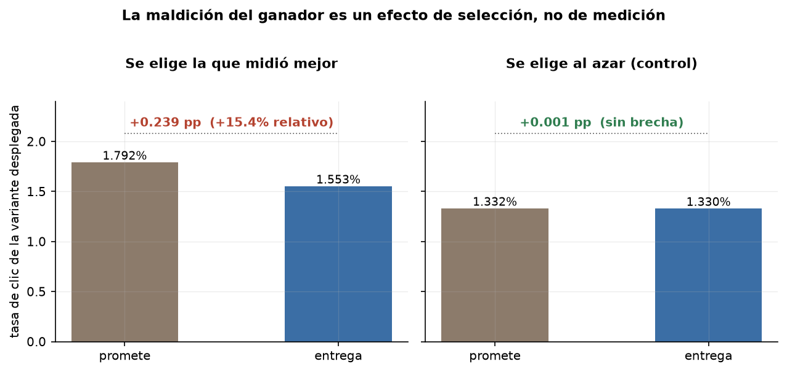
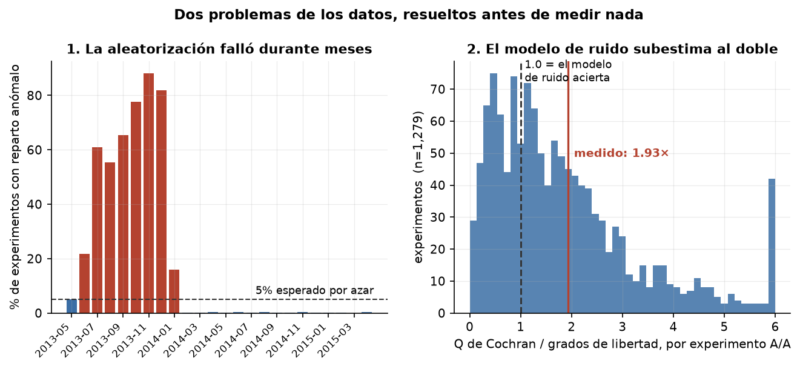
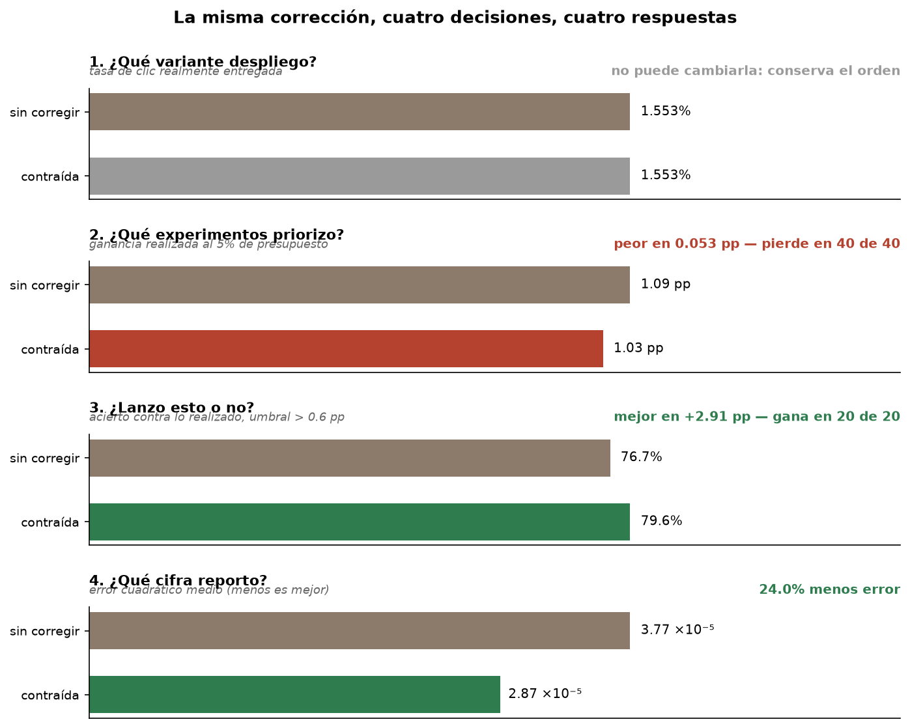
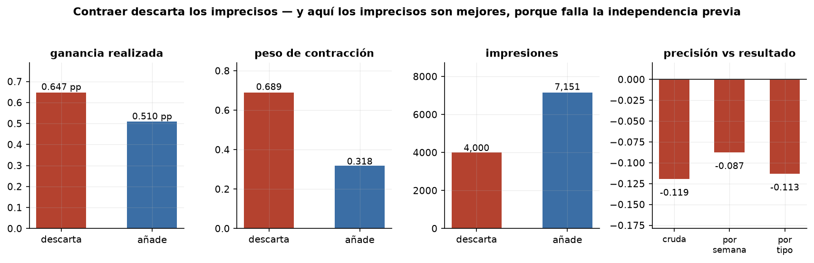
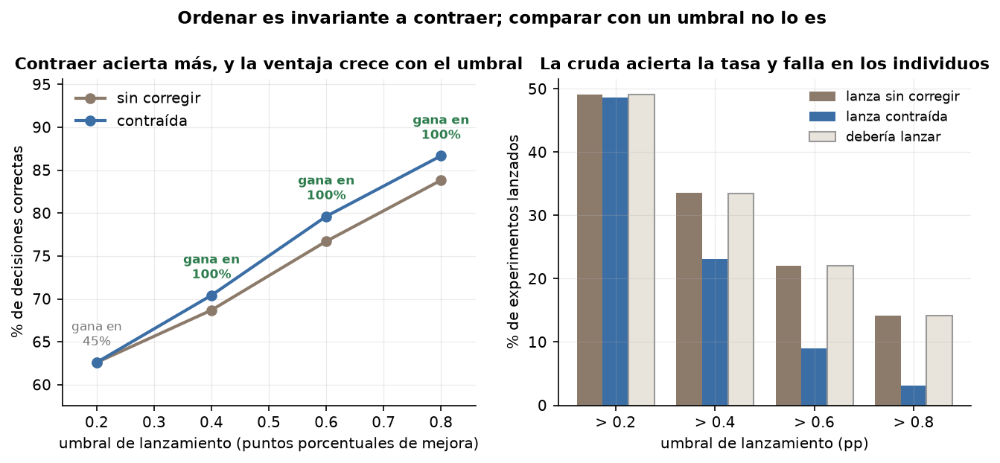
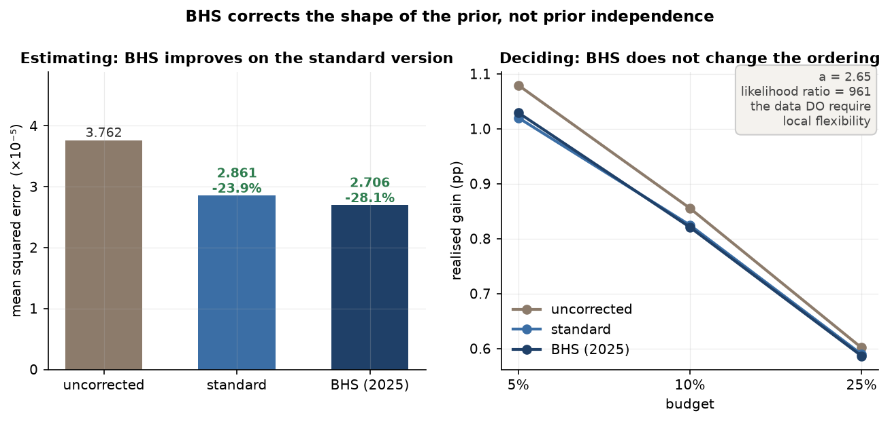

## BACKGROUND

En sectores que no tienen relación entre sí —comercio digital, medios, marketplaces, educación, biología, medicina— se proponen varias versiones de una misma propuesta (anuncios, descuentos, promociones, titulares, variantes genéticas, dosis) y es de importancia seleccionar la que dé mejores rendimientos en términos de clics, gasto, retención, efecto clínico o lo que el programa persiga. Sin embargo, **la versión seleccionada por haber rendido mejor tiende después a rendir menos de lo que prometió.**

Es un problema bien conocido y se le llama **la maldición del ganador**. El nombre se lo pusieron tres ingenieros de petróleo en 1971, que documentaron que las compañías ganadoras de las subastas de arrendamiento marítimo obtenían rendimientos inesperadamente bajos «año tras año». Desde entonces aparece documentado con otros nombres en genética, donde los efectos de las variantes más significativas entre un millón están exagerados frente a su valor real; en ensayos clínicos de dosis, donde elegir la de mayor efecto observado produce estimaciones demasiado optimistas; en evaluación docente, donde se contraen las evaluaciones hacia la media; y en selección de gestores de inversión, donde se contrata y despide en los momentos equivocados.

Es debido a que la propuesta a desplegar debe su ventaja a dos cosas a la vez: en parte a ser buena y, por otro lado, a un factor de suerte —ruido— que no se repite al desplegar. **Y el efecto solo aparece porque se seleccionó la mejor**: si se elige una versión al azar, la brecha desaparece. Por eso la corrección que se propone en todos esos sectores es la misma familia, contraer las estimaciones hacia la media del grupo con un peso que crece con la imprecisión de cada medición.

## EL ESTADO ACTUAL

Para decidir cuál variante desplegar existen varios métodos. Las **pruebas A/B** reparten usuarios al azar entre versiones completas; los **bandidos multibrazo** mueven el tráfico hacia la que va ganando sin esperar a cerrar la prueba; el **intercalado** mezcla dos algoritmos dentro de la misma búsqueda de un mismo usuario y se usa en sistemas de ranking; las **pruebas de conmutación** aleatorizan región y franja horaria en lugar de usuarios, y sirven para marketplaces; y los **métodos cuasiexperimentales** —diferencias en diferencias, control sintético, experimentos geográficos— se usan cuando no se puede aleatorizar. Las pruebas A/B son el estándar por tres razones concretas: establecen causalidad porque el reparto es al azar; son sencillas de iterar, porque comparar versiones completas no exige rediseñar el sistema; y escalan, porque las plataformas ya tienen el tráfico que el método necesita.

Pero decidir cómo se reparte el tráfico y decidir qué concluir de lo recogido son dos preguntas distintas, y para la segunda existen otros métodos: el **frecuentista de horizonte fijo**, que fija la muestra y lee el resultado al final y es lo dominante; el **secuencial de grupo**, que permite mirar antes sin inflar el error; el **bayesiano**, que parte de una distribución previa explícita y entrega una posterior interpretable directamente; y el **Bayes empírico**, donde esa previa no se postula sino que se estima del histórico de experimentos de la propia organización.

Conviene aclarar que lo bayesiano no pertenece a un solo eje. El muestreo de Thompson, que gobierna los bandidos, es bayesiano y es una decisión de diseño; la contracción que trata este proyecto es bayesiana y es una decisión de inferencia. Confundirlas lleva a comparar métodos que no compiten entre sí.

**La corrección de la maldición del ganador vive en la parte inferencial.** Se monta encima de una prueba A/B ya corrida, no la sustituye, y consiste en no creerse del todo el resultado del ganador: acercarlo a la media del grupo en una proporción que crece con la imprecisión de la medición. No es una técnica nueva —Stein la demostró en 1956 y Efron y Morris la desarrollaron en los setenta—, pero sí es reciente su paso a las plataformas de experimentación, y ahí es donde no hay consenso.

**Microsoft y Netflix la usan en producción.** El equipo de Análisis y Experimentación de Microsoft modela previas a partir de la distribución histórica de efectos en Bing, y Netflix emplea previas informativas estimadas de experimentos pasados para contraer las estimaciones y reducir los errores de magnitud. **Meta publicó en 2025 su variante más reciente**, *Bayesian Hybrid Shrinkage* (BHS), que añade factores de contracción locales por experimento para reducir la sensibilidad a la elección de previa; es una propuesta presentada a congreso, no un sistema de producción documentado. **Amazon**, junto con MIT y Stanford, trabaja la misma familia aplicada al valor de la decisión. Y **Spotify publicó por qué no la adopta**: reconoce que una previa bien calibrada contrarresta el sesgo, pero advierte que mantenerla calibrada a través de métricas y programas es exigente y que **mal calibrada resulta activamente peor** que no corregir.

Un estudio causal conlleva entonces tres opciones: adivinar, apostar por lo que hace la plataforma más grande, o invertir en investigación y aplicación. La tercera cambia cómo se reporta cada resultado al negocio, cuesta un trimestre de ingeniería, y equivocarse tiene costo en dos direcciones: si la corrección funciona y no se usa, se dejan mejoras sobre la mesa; **si se usa donde no corresponde, se decide peor que no corrigiendo nada.**

## EL PROBLEMA

El problema especificado es en realidad algo más difícil, ya que **no es simplemente tomar una decisión, son cuatro**, y la literatura las trata como si fueran la misma:

1. **¿Qué variante despliego?** — ordenar candidatos dentro de un experimento.
2. **¿Qué experimentos priorizo?** — ordenar con presupuesto limitado.
3. **¿Lanzo esto o no?** — comparar contra un umbral absoluto.
4. **¿Qué cifra le reporto al negocio?** — la estimación misma.

Esa distinción no es propia de este trabajo. La genética ya la nombra: separa el **sesgo de ranking**, que nace de ordenar un millón de variantes, del **sesgo de selección**, que nace de usar un umbral. Son dos mecanismos distintos, y nada garantiza que una corrección arregle los dos.

Este proyecto **analiza un escenario hipotético pero muy parecido al que enfrentan hoy esos sectores**, empleando datos reales de un medio digital estadounidense que probaba de forma sistemática titulares e imágenes antes de publicar cada artículo. No son datos de campañas publicitarias ni de ninguna empresa que esté tomando esta decisión hoy; **lo que reproducen no es el dato, es el procedimiento** —lanzar varias versiones, repartir el tráfico al azar, medir una tasa de conversión y desplegar la ganadora—, que es el mismo bucle que corre hoy un equipo de comercio digital. Y es la estructura de ese bucle, no el sector ni la métrica ni el año, la que determina si la corrección funciona.

Sobre esos datos se mide cuánto sobreestima la variante ganadora, y después se evalúa si la contracción de Bayes empírico y la variante BHS de Meta corrigen cada una de las cuatro decisiones. **Las cuatro se miden por separado, y dan cuatro respuestas distintas.**

---

# CÓMO SE RESOLVIÓ

## Los datos

Son el **Upworthy Research Archive** ([Matias, Munger, Aubin Le Quéré y Ebersole, *Scientific Data* 8:195, 2021](https://www.nature.com/articles/s41597-021-00934-7)), publicado con licencia abierta. Los datos ideales serían los del propio equipo que toma la decisión, pero nadie los publica, así que lo que importa es que este archivo reúna las condiciones estructurales que el problema exige.

| | Exploratorio | Confirmatorio |
|---|---|---|
| Experimentos tras exclusión | 3 380 | **15 787** |
| Variantes | 16 629 | **77 446** |
| Impresiones | 58.8 millones | **273.5 millones** |
| Clics | 749 878 | **3 492 259** |
| Variantes por experimento | 2 a 14 (mediana 5) | 2 a 20 (mediana 5) |
| Tasa de clic | 1.28% | 1.28% |

Reúne seis condiciones que casi ningún archivo público reúne juntas, y cada una resuelve un problema concreto. La **aleatorización real** —19 167 experimentos— evita que el efecto de selección se confunda con sesgo de asignación. Las **varias variantes por experimento** —mediana de 5, hasta 20— son necesarias porque la maldición vive en el máximo sobre candidatos, y con solo dos apenas hay de dónde seleccionar. Los **15 787 experimentos** permiten estimar la dispersión entre ellos, muy por encima de los 200 que la literatura fija como mínimo. Los **1 279 experimentos A/A** dan una vara independiente para auditar el modelo de ruido. La **partición previa** en muestra exploratoria y confirmatoria, incluida por los autores, permite congelar el método y confirmarlo sin contaminación. Y la **precisión heterogénea** —las impresiones varían 7.1 veces entre el percentil 99 y el 1— es lo que hace que el peso de contracción pueda variar entre experimentos.

Lo que el archivo no tiene: es un solo medio, una sola métrica de clic, el periodo 2013–2015, y datos agregados sin nivel de persona. **Transfiere el procedimiento y sus umbrales; los números concretos, no.**

## Dos problemas de los datos, resueltos antes de medir nada

**La aleatorización falló durante meses y el archivo público no lo marca.** Los autores publicaron en 2024 que una mala configuración de caché, el 25 de junio de 2013, hizo que durante meses se mostrara una sola variante, afectando a ~22% de las pruebas. Los CSV no traen la columna que las identifica, así que se verificó desde cero con una prueba de bondad de ajuste sobre las impresiones por variante, que reproduce el fallo mes a mes:

| Mes | Experimentos con reparto anómalo |
|---|---|
| jun-2013 | 22.3% |
| dic-2013 | **86.4%** |
| ene-2014 | 11.0% |
| feb-2014 en adelante | 0.0% a 0.9% |

Se excluye la ventana del 2013-06-01 al 2014-02-01: **6 956 de 22 743 experimentos fuera (30.6%)**. El periodo conservado corre a la tasa de anomalía que se esperaría por azar.

**Y el modelo de ruido no describe estos datos.** Toda contracción depende de la varianza de cada medición, y los experimentos A/A —donde nada varía entre variantes— dan una vara independiente: la diferencia verdadera es cero por construcción, así que la dispersión observada debería igualar la calculada. No lo hace. La *Q* de Cochran vale **1.940** veces sus grados de libertad en el exploratorio y **1.927** en el confirmatorio, de modo que el modelo binomial subestima el ruido cerca del doble, y **replica en las dos muestras**. Dos explicaciones son compatibles con esto —que las impresiones no sean independientes, o que variaran campos que el archivo no publica— y no son distinguibles con estos datos, así que ambas quedan declaradas.

*La variante elegida promete más de lo que entrega. Elegir al azar no produce brecha: la maldición es un efecto de selección, no de medición.*

*Izquierda: el fallo de aleatorización mes a mes, verificado desde cero porque los CSV no lo marcan. Derecha: la Q de Cochran sobre los experimentos A/A, donde la diferencia verdadera es cero por construcción.*

## El estado del arte, aplicado

La corrección a evaluar es la **contracción de Bayes empírico**, con la dispersión entre experimentos estimada en conjunto mediante los métodos que el meta-análisis desarrolló para combinar muchos estudios. Junto a ella se implementa **BHS**, la variante de Meta de 2025 con factores de contracción locales por experimento, y la **probabilidad de cola posterior**, que es la regla alternativa cuando el criterio no es el valor realizado sino la probabilidad de superar un corte. Para evaluar fuera de muestra sin datos extra se usa **data thinning**, que parte los conteos de forma hipergeométrica en mitades independientes. Y como diagnósticos se corren la **dependencia entre precisión y parámetro**, que comprueba si se sostiene el supuesto central de la corrección, y el **régimen n·p**, que decide si corresponde la versión gaussiana o la binomial directa.

Dos decisiones de método vale la pena explicitar, porque sin ellas el resultado no se sostiene.

**Por qué hubo que partir en tres tercios y no en dos.** La ventaja del ganador, el máximo menos la media, es un estadístico **ya seleccionado**, y el Bayes empírico supone una estimación que no lo sea. Con dos mitades la dispersión entre experimentos se estimaba en **cero** y la calibración colapsaba. La solución fue partir en tres —uno elige el brazo, otro estima su ventaja, otro evalúa—, de modo que la ventaja estimada corresponde a un brazo ya fijado. La dispersión pasó de 0 a 1.787e-05 y la corrección volvió a funcionar. Esto importa más allá de este proyecto, porque es un bloqueo que la literatura enuncia y deja abierto: los corpus seleccionados por el ganador impiden la calibración **independientemente del tamaño del corpus**, y recoger más datos de la misma fuente sesgada no ayuda. La respuesta no es recoger más, es partir los conteos que ya se tienen.

**Y cómo se sabe si BHS hacía falta.** El modelo de BHS se reparametrizó de modo que un solo parámetro, `a`, gobierne la flexibilidad local: con `a` grande reproduce exactamente la contracción estándar —el caso que el propio artículo de Meta llama *Bayesian Global Shrinkage*— y con `a` chico da colas pesadas. Ajustar `a` es entonces preguntarle a los datos cuánta flexibilidad local necesitan. La implementación se validó en tres casos construidos, incluido el decisivo: con una previa normal el método responde que no hace falta (razón de verosimilitudes 0.67, p = 0.41). Sin esa comprobación, lo que diga sobre los datos reales no significaría nada.

---

# LO QUE SE ENCONTRÓ

El método se congeló el 3 de octubre de 2026 —con fecha, commit de git y criterio de éxito declarado— y entonces se corrió la muestra confirmatoria **una sola vez**.

## La maldición del ganador es real y grande

La variante desplegada promete 1.792% y entrega 1.553%: una **sobreestimación del 15.4% relativo**, medida sobre lo que esa variante realmente rinde. Replica entre muestras —0.236 pp de inflación en el exploratorio y 0.237 en el confirmatorio— y es un efecto de selección y no de medición, porque elegir una variante al azar da una inflación cien veces menor.

## Las cuatro decisiones, cuatro respuestas

*La misma corrección sobre cuatro decisiones distintas. Cada panel está en sus propias unidades a propósito: normalizarlas a un eje común sería disfrazar cantidades distintas de comparables.*

| La decisión | ¿Ayuda contraer? | La cifra |
|---|---|---|
| **1. Qué variante despliego** | **No, y no puede** | 99.8% de decisiones idénticas |
| **2. Qué experimentos priorizo** | **No, levemente peor** | −0.0556 pp, IC 95% [−0.0619, −0.0493], pierde en 40/40 |
| **3. Lanzo o no** | **Sí, y crece con la exigencia** | +1.73 a +2.91 pp de acierto, gana en 20/20 |
| **4. La cifra que reporto** | **Sí** | −24.0% estándar, **−28.1%** con BHS |

**La decisión 1 no puede mejorarse, y eso se demuestra.** La contracción es un promedio ponderado entre el dato y un centro común, así que si el peso y el centro son iguales para las variantes de un experimento, es una función monótona creciente del estimador y conserva el orden. En estos datos el peso varía **0.009** entre variantes del mismo experimento, porque reciben tráfico parejo por diseño: la razón entre la más y la menos expuesta tiene mediana 1.040. Con variantes balanceadas no había un problema de selección que mejorar.

**La decisión 2 empeora, y se sabe por qué.** Al 10% de presupuesto la corrección cambia el 23.0% de la selección: descarta experimentos con peso 0.689 y 4 000 impresiones, y añade otros con peso 0.318 y 7 151. Es decir, descarta los imprecisos y añade los precisos, que es lo que la teoría dice que hace bajo restricción de capacidad. Pero **los que descarta tenían más ganancia real** (0.647 contra 0.510 pp), porque el supuesto de independencia previa falla: la correlación entre impresiones y tasa es −0.119 cruda, **−0.087 dentro de cada semana** (66 semanas) y **−0.113 dentro de cada tipo de experimento**. Sobrevive al control.

*El mecanismo del daño: la corrección descarta los experimentos imprecisos, y en este corpus los imprecisos tienen mejor resultado real porque la precisión y el resultado están correlacionados.*

**La decisión 3 sí mejora, y la razón es la asimetría que separa ordenar de comparar.** Ordenar es invariante a una transformación monótona, así que contraer no puede cambiar el argmax. Comparar contra un umbral absoluto no lo es: contraer cambia el valor, así que cambia si cruza la línea.

| Umbral de lanzamiento | Acierto cruda | Acierto contraída | Mejora | Gana en |
|---|---|---|---|---|
| > 0.2 pp | 62.60% | 62.61% | +0.01 pp | 45% |
| > 0.4 pp | 68.69% | 70.42% | **+1.73 pp** | **100%** |
| > 0.6 pp | 76.72% | 79.62% | **+2.91 pp** | **100%** |
| > 0.8 pp | 83.83% | 86.68% | **+2.85 pp** | **100%** |

Con umbral exigente la regla cruda lanza el 14.2% y la verdad es 14.2%: acierta la tasa y se equivoca en los individuos. La contraída lanza el 3.2% y acierta más, porque la mayoría de los experimentos genuinamente no cruza un umbral alto y contraer lo dice bien.

*Donde la corrección sí gana. La ventaja crece con la exigencia del umbral, y a partir de 0.4 pp gana en las 20 particiones.*

## La variante más reciente estima mejor y tampoco cambia el orden

Los datos piden la flexibilidad local de BHS sin ambigüedad: el parámetro ajustado es **a = 2.65** (rango 2.52 a 2.79 en 12 particiones), con una **razón de verosimilitudes de 961** contra la versión estándar, sobre un grado de libertad. Es una previa t con 2.65 grados de libertad, colas casi tan pesadas como el modelo admite, y coincide con la asimetría de +1.19 medida antes por una vía independiente.

BHS cumple lo que promete y **estima mejor que la versión estándar**: −28.1% de error contra −23.9%. Pero la diferencia en la decisión de orden es +0.0092 pp y gana en el **0%** de las particiones.

El motivo ya estaba medido. BHS corrige la **forma** de la previa, con colas pesadas; lo que falla aquí es la **independencia previa**. Hacer la previa más flexible no hace que la precisión sea independiente del parámetro: son dos supuestos distintos, y BHS solo toca uno.

*La variante de 2025 estima mejor que la estándar y deja el orden donde estaba. Los datos piden su flexibilidad local sin ambigüedad, pero esa flexibilidad corrige otro supuesto.*

## Y el resultado favorable más citado vale en su régimen

El trabajo empírico más cercano sobre este mismo archivo filtra las variantes con menos de 1 000 impresiones o 100 clics, «para asegurar que las aproximaciones de normalidad sean razonables». Ese filtro conserva el **6.9%** de las variantes. Medido dentro y fuera:

| Al 5% de presupuesto | Su régimen | Archivo completo |
|---|---|---|
| Experimentos | 1 277 | 15 787 |
| Ganancia, contraída − cruda | +0.0148 pp | −0.0556 pp |
| IC 95% | [−0.0153, +0.0448] | [−0.0619, −0.0493] |
| ¿Se distingue de cero? | **No** | **Sí** |

En el régimen que conservan, contraer es neutro para el orden —el intervalo cruza el cero—, que es lo que su teorema predice. Fuera de él degrada la selección de forma medible. **No es un cambio de signo: es un límite de validez.**

---

# RECOMENDACIONES

Para un equipo que está evaluando adoptar la corrección, cada punto es una observación medida y la acción que se sigue de ella.

**La variante ganadora sobreestima un 15.4% relativo, y eso sí se corrige. Conviene adoptar la corrección para lo que se reporta al negocio y para decidir si se lanza**, porque reduce el error un 24% y mejora el acierto de la decisión de lanzamiento hasta 2.9 puntos, ganando en todas las particiones evaluadas.

**Pero no conviene justificarla como una mejora de qué variante se elige.** Basta medir la razón de impresiones entre la variante más y la menos expuesta: si está cerca de 1, hay una razón algebraica para que la corrección no reordene. Es una línea de código y evita un trimestre mal vendido.

**Antes de usarla para priorizar entre experimentos hay que medir la correlación entre precisión y resultado, porque si es negativa la corrección hará escoger peor.** Aquí vale −0.12 y sobrevive al control por periodo y por tipo. Son tres líneas de código, y es el diagnóstico de mayor rendimiento del procedimiento.

**El modelo de ruido se audita contra experimentos A/A antes que nada, y si la plataforma no corre A/A hay que empezar por ahí**, porque sin una vara independiente no se puede saber si la varianza —el insumo del que todo depende— está bien medida. Aquí estaba subestimada al doble.

**Si la ventaja estimada viene de un máximo, no se contrae directamente: se parten los conteos en tres**, uno elige, otro estima y otro evalúa. Con dos la dispersión se estima en cero y la corrección deja de funcionar, por una razón que no se ve hasta que pasa.

**Y conviene comprobar el régimen propio antes de apoyarse en un resultado publicado**, porque los resultados favorables más citados se obtuvieron en condiciones filtradas que pueden no ser las del equipo que los cita.

---

# SUPUESTOS Y ADVERTENCIAS

**El modelo de ruido se rechaza y las dos explicaciones posibles no son distinguibles.** *Q*/gl ≈ 1.93. Puede ser que las impresiones no sean independientes, o que variaran campos que el archivo no publica. Ambas quedan declaradas; ninguna se elige por conveniencia.

**La exclusión del 30.6% se verificó, no se heredó.** Los CSV no marcan las pruebas afectadas, así que la ventana se determinó con una prueba estadística propia. Ante la duda sobre cuándo se creó un experimento, se excluye.

**Se aplicó un factor de varianza al nivel equivocado y se fabricó un resultado falso.** Se reportó primero que contraer perjudica el orden en 0.27 pp, usando el factor de diseño 1.94 —medido para comparaciones entre variantes— sobre la ganancia entre experimentos. Se detectó con una referencia que no usa la varianza, una covarianza que estima la dispersión directamente, y que da ~1.09 para ese nivel. **El factor de diseño no transfiere entre niveles.**

**Se escribió una interpretación antes de ver los números y los números la contradijeron.** Se afirmó que el peso de contracción era ~0.95 en todos los casos; medido, iba de 0.413 a 1.000.

**Un primer titular no sobrevivió a su propio intervalo de confianza.** Se leyó «el signo cambia entre regímenes»; con 40 particiones e intervalo, el régimen filtrado no se distingue de cero. Queda el límite de validez, que es menos vistoso y es lo que los datos aguantan.

**Y una cifra se publicó con el denominador equivocado hasta que una figura la puso en evidencia.** La sobreestimación se había dividido entre la tasa base global de 1.28% en lugar de entre lo que la variante elegida realmente entrega, 1.553%. La cifra correcta es 15.4%, no 18.5%.

**La previa normal está mal especificada por construcción.** La asimetría de la ganancia es +1.19 cuando la normal supone 0, porque es la ventaja de una variante ya seleccionada. Por eso el orden por media posterior no alcanza su óptimo teórico, y por eso se implementó BHS.

**Un solo medio, una sola métrica, 2013–2015, datos agregados.** Ninguna cifra de este documento debe usarse como expectativa para otra plataforma.

**Lo que no se implementó, con su razón.** La contracción binomial directa queda fuera **por diagnóstico**: n·p mediana = 40 y 0.1% de variantes bajo 10, así que la aproximación gaussiana no es el problema aquí. La implementación de referencia de Chen está en R y este proyecto es Python, de modo que es un **costo operativo declarado**, no una omisión; su diagnóstico sí se corrió, y es el que explica el resultado principal.

---

# SOBRE QUÉ SE APOYA TODO ESTO

El marco de la decisión —que las tasas de error, la exactitud de estimación y el arrepentimiento son **riesgos distintos**, y que el método apropiado se sigue de los riesgos que un programa necesita controlar— es de [Schultzberg y Frånberg (Spotify, ago-2026)](https://arxiv.org/abs/2608.12949). Su jerarquía de tres niveles organiza las configuraciones bayesianas por la fuerza de su control de error y establece que el Bayes empírico es el único camino al tercero. Este proyecto mide en un corpus real las cuatro ramas que ellos comparan en simulación, y resuelve con partición en tres tercios el bloqueo de los corpus seleccionados por el ganador, que ellos enuncian y demuestran.

| Pieza | Fuente |
|---|---|
| La contracción misma | Stein (1956), James y Stein (1961); Robbins le dio el nombre, Efron y Morris la desarrollaron en los setenta |
| Dispersión estimada en conjunto | DerSimonian y Laird; Paule y Mandel |
| Auditar el ruido con A/A | *Q* de Cochran (1954) |
| Evaluación fuera de muestra | *Data thinning*, [Neufeld, Dharamshi, Gao y Witten (*JMLR* 2024)](https://jmlr.org/papers/v25/23-0446.html) |
| Factores locales por experimento | *Bayesian Hybrid Shrinkage*, [Mudd, Friedberg, Gorbachev, Nassif y Zaidi (Meta, 2025)](https://arxiv.org/abs/2511.06318) |
| Que la función de pérdida cambia el orden óptimo | [Gu y Koenker (*Econometrica*, 2023)](https://www.econometricsociety.org/publications/econometrica/2023/01/01/invidious-comparisons-ranking-and-selection-as-compound-decisions) |
| Que la independencia previa puede fallar y empeorar el cribado | [Chen (*Econometrica* 94(2), 2026)](https://arxiv.org/abs/2212.14444) |
| El régimen donde la aproximación gaussiana flaquea | Chen y Lei (dic-2025) |
| Que seleccionar es más fácil que estimar | [Coey y Hung (Meta)](https://arxiv.org/abs/2210.03905) |
| Ranking y umbral como sesgos distintos | La literatura de genética los separa: sesgo de ranking y sesgo de selección |
| Los datos | [Matias, Munger, Aubin Le Quéré y Ebersole (*Scientific Data*, 2021)](https://www.nature.com/articles/s41597-021-00934-7) |

Y el problema de fondo está documentado en subastas desde 1971, en genética, en ensayos clínicos de dosis, en evaluación docente y en selección de gestores de inversión. Es el mismo problema con seis nombres; lo que cambia es qué se elige y cuánto cuesta equivocarse.

---

## REPRODUCIR

El código de ingesta, construcción del panel y los diagnósticos está en [`src/wcab/`](src/wcab/); los scripts que generan cada cifra citada, en [`scripts/`](scripts/); las cifras crudas, en [`reports/results/`](reports/results/); y las figuras, en [`reports/figures/`](reports/figures/), generadas desde esas mismas cifras sin ningún número escrito a mano.

El método congelado antes de correr la muestra confirmatoria está en [`reports/results/METODO_CONGELADO.json`](reports/results/METODO_CONGELADO.json), con fecha, commit de git y criterio de éxito. El proyecto no tiene SQL —el procesamiento es Python sobre dos CSV planos— ni panel interactivo.
